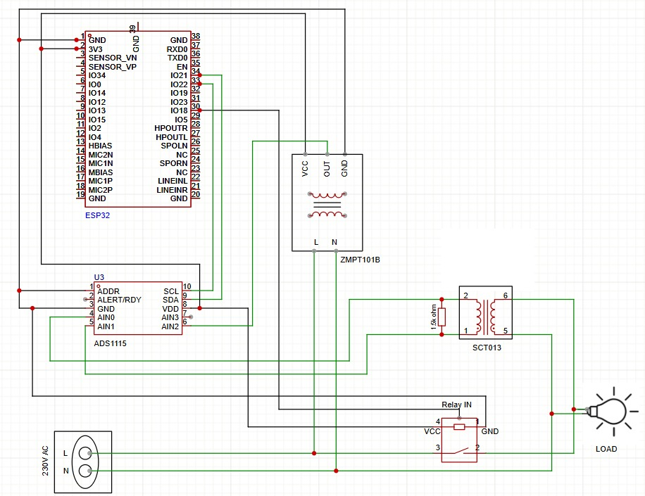
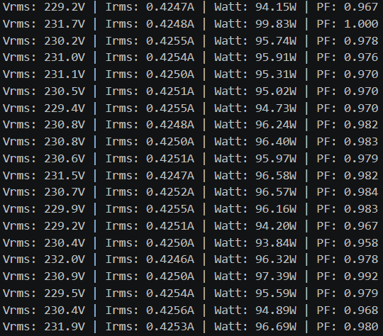
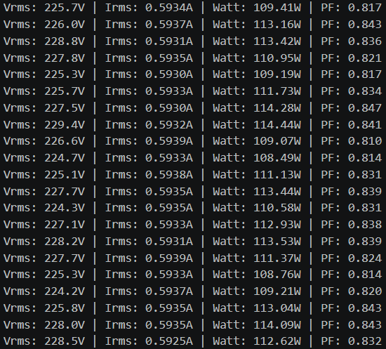
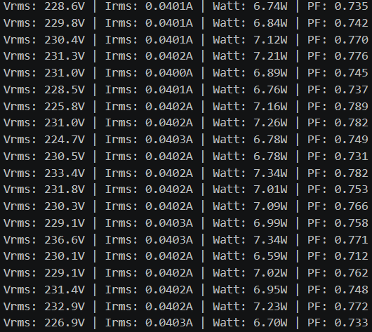
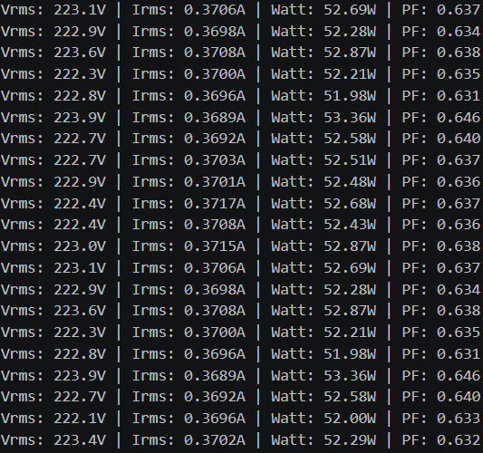

# ESP32 True RMS Energy Monitor

A real-time AC energy monitoring and overload protection system built using an ESP32, ADS1115 ADC, SCT-013 current transformer, and ZMPT101B voltage sensor.

The system performs high-precision waveform sampling to calculate:

- True RMS Voltage
- True RMS Current
- Real Power
- Apparent Power
- Power Factor
- Overload Detection and Relay Protection

Unlike basic energy meters that assume ideal sine-wave conditions, this project performs instantaneous waveform analysis with software-based phase correction for more accurate measurements across resistive, inductive, and non-linear loads.

---

# Overview

This project uses an external 16-bit ADS1115 ADC with an ESP32 to sample AC voltage and current waveforms at high speed.

The firmware continuously:

1. Measures voltage using the ZMPT101B sensor
2. Measures current using the SCT-013 current transformer
3. Removes DC offsets dynamically
4. Applies phase-shift correction
5. Computes RMS and power quantities
6. Detects overload conditions
7. Disconnects the load through a relay if abnormal conditions persist

The system is suitable for:

- Smart energy monitoring
- Embedded power electronics projects
- Electrical load analysis
- Appliance protection systems
- IoT energy management systems

---

# Circuit Diagram



---

# Key Features

- True RMS voltage measurement
- True RMS current measurement
- Real-time real power calculation
- Apparent power calculation
- Power factor estimation
- Dynamic midpoint bias correction
- Software-based phase compensation
- 16-bit precision sampling using ADS1115
- Relay-based overload protection
- Support for:
  - Resistive loads
  - Inductive loads
  - Non-linear loads

---

# Hardware Components

| Component | Purpose |
|---|---|
| ESP32 | Main controller and processing unit |
| ADS1115 | External 16-bit ADC |
| SCT-013 | Non-invasive AC current sensing |
| ZMPT101B | AC voltage sensing |
| Relay Module | Automatic overload cutoff |
| AC Loads | Testing and validation |

---

# Pin Connections

## ESP32 ↔ ADS1115

| ESP32 Pin | ADS1115 Pin |
|---|---|
| GPIO 21 | SDA |
| GPIO 22 | SCL |
| 3.3V | VCC |
| GND | GND |

## Sensors

| Sensor | ADS1115 Channel |
|---|---|
| ZMPT101B Voltage Sensor | A2 |
| SCT-013 Current Sensor | Differential A0-A1 |

## Relay

| ESP32 Pin | Purpose |
|---|---|
| GPIO 26 | Relay Control |

---

# Libraries Used

Install the following libraries in Arduino IDE:

- Wire.h
- Adafruit ADS1X15

---

# Working Principle

## Voltage Measurement

The ZMPT101B sensor measures AC mains voltage.

Voltage samples are acquired through:

```cpp
ads.readADC_SingleEnded(2)
```

The ADC readings are calibrated and converted into real voltage values.

---

## Current Measurement

The SCT-013 current transformer measures load current non-invasively.

Differential ADC sampling is used for better noise immunity:

```cpp
ads.readADC_Differential_0_1()
```

---

## Dynamic Midpoint Correction

Sensor outputs contain DC bias offsets.

To remove this offset, the firmware calculates dynamic midpoints before every measurement cycle:

```cpp
vMid = average voltage offset
```

```cpp
iMid = average current offset
```

This improves:

- RMS stability
- Noise reduction
- Long-term accuracy
- Thermal drift compensation

---

# RMS Computation

Voltage and current RMS values are calculated using sampled waveform data.

## Voltage RMS

```math
V_{RMS} = \sqrt{\frac{1}{N}\sum V_i^2}
```

## Current RMS

```math
I_{RMS} = \sqrt{\frac{1}{N}\sum I_i^2}
```

---

# Real Power Calculation

Instantaneous power is computed sample-by-sample:

```math
P = \frac{1}{N}\sum v_i i_i
```

This enables accurate power analysis even for:

- Inductive loads
- Non-linear loads
- Loads with phase shifts

---

# Apparent Power and Power Factor

## Apparent Power

```math
S = V_{RMS} \times I_{RMS}
```

## Power Factor

```math
PF = \frac{P}{S}
```

where:

- \(P\) = Real Power
- \(S\) = Apparent Power

---

# Phase Shift Compensation

The ADS1115 samples channels sequentially rather than simultaneously.

This introduces a small timing mismatch between voltage and current measurements.

To compensate for this delay, the firmware performs interpolation-based phase correction:

```cpp
float correctedV = lastV + (PHASE_SHIFT * (instV - lastV));
```

This significantly improves:

- Real power accuracy
- Power factor accuracy
- Inductive load analysis

The current firmware uses:

```cpp
#define PHASE_SHIFT 1.45
```

This value can be experimentally tuned for maximum accuracy.

---

# Sampling Configuration

| Parameter | Value |
|---|---|
| ADC Sampling Rate | 860 SPS |
| Samples per Measurement | 400 |
| AC Frequency | 50 Hz |
| Captured Cycles | ~23 cycles |

Capturing multiple AC cycles improves:

- RMS stability
- Noise filtering
- Real power accuracy
- Power factor consistency

---

# Calibration Constants

The firmware uses experimentally calibrated constants:

```cpp
#define V_CALIBRATION 306
#define I_CALIBRATION 2.36
```

These constants convert ADC readings into actual electrical quantities.

Calibration was performed using reference multimeter measurements.

---

# Overload Protection Logic

The system continuously monitors:

- RMS current
- Real power

## Protection Conditions

The relay protection activates when:

```cpp
Irms > 0.60
```

or

```cpp
realPower > 120
```

for multiple consecutive monitoring cycles.

The firmware maintains an abnormal condition counter:

```cpp
abnormal_count
```

If abnormal conditions persist for 3 consecutive cycles:

```cpp
digitalWrite(RELAY_PIN, HIGH);
```

The connected load is disconnected automatically.

This prevents:

- Overcurrent damage
- Overpower conditions
- Unsafe appliance operation

---

# Serial Monitor Output

Example serial output:

```text
Vrms: 223.5V | Irms: 0.4210A | Watt: 91.32W | PF: 0.968
```

The firmware displays:

- RMS Voltage
- RMS Current
- Real Power
- Power Factor

in real time.

---

# Experimental Results

## Incandescent Bulb Monitoring



---

## Heating Coil Monitoring



---

## LED Bulb Monitoring



---

## Fan Load Monitoring



---

# Overload Protection Demonstration

The system continuously monitors abnormal current and power conditions.

If overload persists for multiple monitoring cycles:
- Relay protection activates automatically
- Load is disconnected for safety

### Demonstration Note

For demonstration purposes, the overload protection threshold in the demo video was temporarily reduced to **95W**.

An incandescent bulb rated at **100W** was connected to the system.

When the measured real power exceeded the threshold for three consecutive monitoring cycles, the relay protection logic automatically disconnected the load.

In normal operation, the actual protection threshold is configured around **120W**.

---

# Repository Structure

```text
ESP32-True-RMS-Energy-Monitor/
│
├── results/
│   ├── heating_coil_results.png
│   ├── incandescent_bulb_results.png
│   ├── led_bulb_results.png
│   ├── table_fan_results.png
│   └── overload_protection_demo.mp4
│
├── circuit_diagram.jpeg
├── ESP32_True_RMS_Energy_Monitor.ino
└── README.md
```

---

# Future Improvements

- Simultaneous ADC sampling
- Harmonic analysis
- Wireless cloud monitoring
- MQTT/IoT integration
- OLED or LCD display support
- Mobile dashboard integration
- Three-phase monitoring
- Data logging and analytics

---

# Technologies Used

- ESP32
- Arduino IDE
- Embedded C++
- ADS1115 ADC
- I2C Communication
- AC Signal Processing

---

# Author

**Abhradeep Kayal**  
Electrical Engineering  
IIEST Shibpur

---

# Related Repositories

- Overload Detection Model (RF Classifier)
- Predictive Energy Intelligence System (Machine Learning & Predictive Analytics)
- Smart Energy Monitoring Mobile Application (Flutter App)
